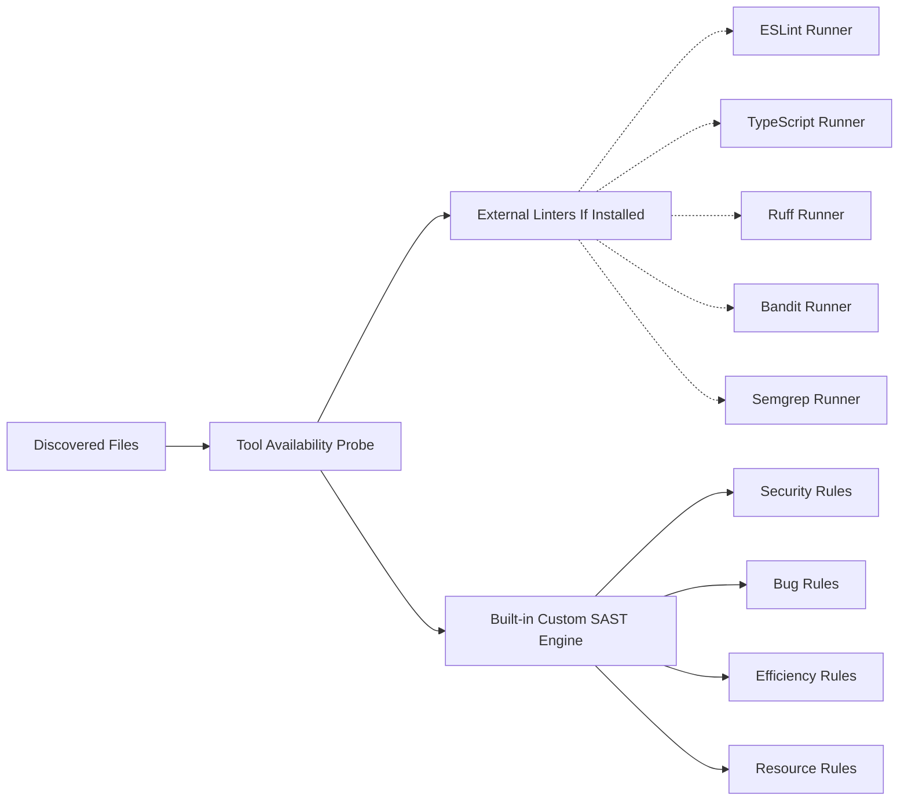
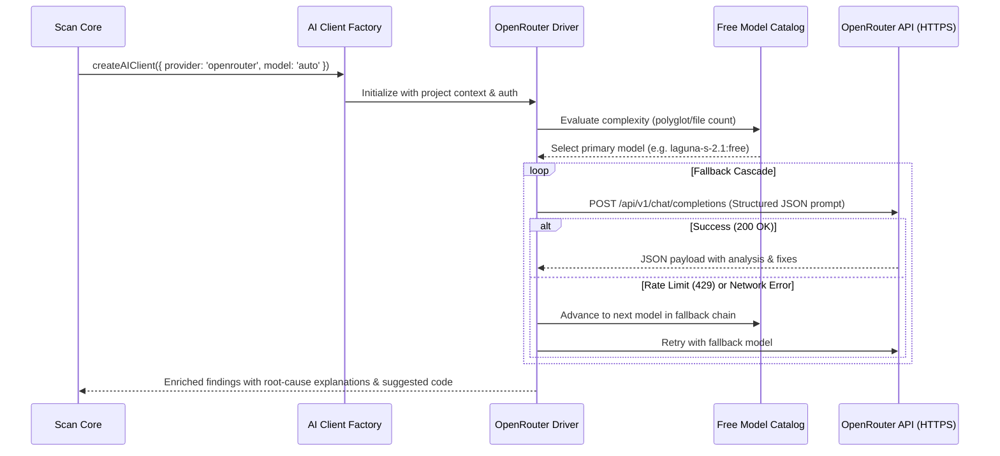

# CodeSentry Architecture & Technical Workflow

> **Zero-Dependency DevSecOps & AI Code Inspection Engine**  
> Complete technical reference explaining how CodeSentry's architecture, multi-tier analysis pipeline, AI verification layer, interactive repair engine, and terminal UX operate end-to-end.

---

## 1. System Architecture Overview

CodeSentry is structured as a layered, modular DevSecOps platform built on **pure Node.js** with zero external runtime dependencies and **zero Docker requirement**. It integrates deterministic static analysis (SAST) with contextual large language model (LLM) verification and interactive terminal-driven remediation.

```mermaid
flowchart TD
    subgraph Ingestion ["1. INGESTION & DISCOVERY"]
        CLI["CLI Command / npx Invocation<br><code>npx github:kaunteyaarjun/code_inspection_tool scan .</code>"]
        Config["Config Resolver<br><code>src/core/config.js</code><br>+ Global <code>~/.codesentry/config.json</code>"]
        Discovery["Discovery Engine<br><code>src/discovery/discover.js</code><br>Language detection & file walk"]
        Ignore["Ignore Cascade<br><code>.codesentryignore</code> + <code>.gitignore</code><br>+ vendor exclusions"]
        
        CLI --> Config --> Discovery
        Discovery --> Ignore
    end

    subgraph StaticAnalysis ["2. MULTI-TIER STATIC ANALYSIS PIPELINE"]
        ToolProbe["Tool Availability Probe<br><code>src/analyzers/static/tools.js</code>"]
        ExtLinters["External Adapters (Optional)<br>ESLint · TypeScript · Ruff · Bandit · Semgrep"]
        CustomSAST["Native Custom SAST Engine<br><code>src/analyzers/custom/index.js</code>"]
        SecSAST["Security Analyzer<br>SQLi · Code Exec · Secrets · Paths · Crypto"]
        BugSAST["Bugs Analyzer<br>Loose == · Off-by-one · Catch · Returns"]
        EffSAST["Efficiency Analyzer<br>DOM Thrashing · Unindexed Loops"]
        ResSAST["Resources Analyzer<br>File Handles · Leaked Timers / Listeners"]

        Ignore --> ToolProbe
        ToolProbe --> ExtLinters
        ToolProbe --> CustomSAST
        CustomSAST --> SecSAST
        CustomSAST --> BugSAST
        CustomSAST --> EffSAST
        CustomSAST --> ResSAST
    end

    subgraph Normalization ["3. NORMALIZATION & SCORING"]
        Norm["Normalizer Engine<br><code>src/findings/normalize.js</code>"]
        Dedupe["Deduplication Engine<br><code>src/findings/dedupe.js</code>"]
        Filter["Threshold & Category Filter<br><code>src/core/scan.js</code>"]
        Aggregate["Finding Aggregator<br><code>src/core/aggregation.js</code>"]
        Score["Quality Scoring Engine<br><code>src/core/scoring.js</code> (0-100)"]
        Verdict["Verdict Engine<br><code>src/core/verdict.js</code> (PASS / WARN / FAIL)"]

        ExtLinters --> Norm
        SecSAST --> Norm
        BugSAST --> Norm
        EffSAST --> Norm
        ResSAST --> Norm
        Norm --> Dedupe --> Filter --> Aggregate --> Score --> Verdict
    end

    subgraph AIVerification ["4. CONTEXTUAL AI TRIAGE LAYER"]
        AICondition{"Findings > 0 &<br>AI Enabled?"}
        Router["OpenRouter Client<br><code>src/analyzers/ai/openrouter.js</code>"]
        Catalog["Dynamic Model Catalog<br>Laguna S 2.1 · Nemotron 3 · MiniMax · Auto"]
        FallbackChain["Fallback Chain<br>Primary ➔ Secondary ➔ Auto ➔ Mock"]
        Enrichment["Finding Enrichment<br>Root-cause explanation · Fix suggestion"]

        Verdict --> AICondition
        AICondition -- Yes --> Router
        Router --> Catalog --> FallbackChain --> Enrichment
        AICondition -- No --> PostScan
    end

    subgraph PostScan ["5. POST-SCAN PRESENTATION & ACTIONS"]
        Format["Terminal UI Formatter<br><code>src/cli/formatter.js</code><br>Theme cards, clickable links, stats"]
        ReportGen["Report Generator<br><code>src/cli/report.js</code><br><code>CODESENTRY-AUDIT-*.md</code>"]
        InteractivePrompt{"Interactive Mode?<br>(TTY Session)"}

        Enrichment --> Format
        Format --> ReportGen --> InteractivePrompt
    end

    subgraph Remediation ["6. INTERACTIVE REMEDIATION & HARDENING"]
        FixEngine["Interactive Fix Engine<br><code>src/cli/fixer.js</code><br>Whole Codebase vs Specific Flaw"]
        DiffPreview["Color-coded Diff Preview<br><code>formatDiffPreview()</code>"]
        SafeApply["Atomic Disk Patch<br><code>applyFixToFile()</code>"]
        Rescan["Automatic Rescan<br>Verification loop"]

        Enhancer["Proactive AI Hardening<br><code>src/cli/enhancer.js</code><br>(Triggered when findings = 0)"]
        ExportMD["Export Advisory<br><code>AI-SECURITY-SUGGESTIONS.md</code>"]

        InteractivePrompt -- Has Findings --> FixEngine --> DiffPreview --> SafeApply --> Rescan
        InteractivePrompt -- Clean Codebase --> Enhancer --> ExportMD
    end
```



---

## 2. Core Architectural Pillars

| Pillar | Technical Implementation | Benefit |
|---|---|---|
| **Zero-Install Execution** | Direct invocation via `npx github:kaunteyaarjun/code_inspection_tool scan .` backed by root `package.json` delegation to `./CodeSentry/bin/codesentry.js`. | Developers can inspect any repository in seconds without cloning or installing dependencies globally. |
| **Pure Node.js Runtime** | Written in vanilla Node.js (>=18.0.0) without native C/C++ addons or Docker daemons. | Runs identically on Windows (PowerShell/CMD), macOS, and Linux without container setup or OS compatibility issues. |
| **Dual-Tier SAST Resilience** | Combines external CLI linters (`eslint`, `tsc`, `ruff`, `bandit`, `semgrep`) with native built-in analyzers (`security.js`, `bugs.js`, `efficiency.js`, `resources.js`). | Even on a fresh machine with zero linters installed, CodeSentry provides 100% functional security and bug analysis out-of-the-box. |
| **Contextual AI Fallback Chaining** | OpenRouter integration with automated model cascading (`Laguna S 2.1` ➔ `Nemotron 3 Ultra` ➔ `MiniMax` ➔ `Auto` ➔ Offline Mock Mode). | Zero downtime. If a remote model is rate-limited or the network is offline, analysis degrades gracefully without crashing. |
| **Safe Atomic Remediation** | 72-column color-coded diff previews (`- red` / `+ green`) with mandatory user approval before applying disk writes, followed by automatic rescan verification. | No accidental file corruption or hallucinated destructive edits. |
| **Terminal-Native Aesthetic** | Custom ANSI theme engine inspired by OpenCode with typewriter progress, pulsing status indicators, and OSC-8 clickable file links. | High-fidelity, premium developer experience in any modern terminal. |

---

## 3. Detailed Layer-by-Layer Breakdown

### Layer 1: CLI Dispatch & Interactive Runtime Host

- **Key Files**:
  - `package.json` (Root)
  - `CodeSentry/bin/codesentry.js`
  - `CodeSentry/src/cli/commands.js`
  - `CodeSentry/src/cli/auth.js`
  - `CodeSentry/src/cli/theme.js`
  - `CodeSentry/src/cli/components/` (`select.js`, `typewriter.js`, `status-indicator.js`)

#### Workflow:
1. **Entry Point Delegation**: When executed via `npx github:kaunteyaarjun/code_inspection_tool scan .`, npm resolves the root `package.json` `"bin"` entry which routes to `CodeSentry/bin/codesentry.js`.
2. **Argument Parsing**: `createCommandParser()` parses CLI flags (`--severity`, `--category`, `--ai-model`, `--no-ai`, `--no-report`, `--json`, `--verbose`).
3. **Global Authentication Hydration**:
   - `auth.loadGlobalConfig()` inspects `~/.codesentry/config.json` (or `%USERPROFILE%\.codesentry\config.json` on Windows).
   - If `OPENROUTER_API_KEY` is not set in the environment or config file, interactive mode launches an interactive token setup prompt.
   - Keys are stored securely in the user's home directory so subsequent executions never prompt again.
4. **Interactive Terminal Loop**:
   - Unlike standard linters that abruptly exit after printing output, CodeSentry operates an interactive command loop in TTY sessions (`process.stdout.isTTY`).
   - After scan results are displayed, an interactive select menu allows the developer to:
     - Apply AI improvements and fixes
     - Request proactive AI security hardening (if clean)
     - Switch active AI models
     - Re-run scan with adjusted parameters
     - Exit cleanly via `Ctrl+C` or menu selection.

---

### Layer 2: File Discovery & Ingestion Engine

- **Key Files**:
  - `CodeSentry/src/discovery/discover.js`
  - `CodeSentry/src/discovery/files.js`
  - `CodeSentry/src/discovery/ignore.js`
  - `CodeSentry/src/discovery/language.js`

#### Workflow:
1. **File Walking**: `discoverFiles()` recursively traverses the target project directory, collecting supported source files:
   - JavaScript / JSX (`.js`, `.jsx`, `.mjs`, `.cjs`)
   - TypeScript / TSX (`.ts`, `.tsx`)
   - Python (`.py`)
2. **Multi-Tier Ignore Cascade**:
   - **Default System Exclusions**: `node_modules`, `.git`, `dist`, `build`, `.next`, `coverage`, `__pycache__`, `.venv`, `venv`.
   - **Gitignore Ingestion**: Reads and compiles `.gitignore` rules into regex patterns.
   - **Custom Sentry Rules**: Ingests `.codesentryignore` from project root.
   - **Test Fixture Protection**: Test fixtures (`tests/fixtures/**`) are automatically isolated to prevent test fixtures from skewing project-level audits.
3. **Language Profiling**: Identifies primary language composition and detects multi-language polyglot codebases for intelligent model routing.

---

### Layer 3: Multi-Tier Static Analysis Pipeline

- **Key Files**:
  - `CodeSentry/src/analyzers/static/tools.js`
  - `CodeSentry/src/analyzers/static/orchestrator.js`
  - `CodeSentry/src/analyzers/custom/index.js`
  - `CodeSentry/src/analyzers/custom/security.js`
  - `CodeSentry/src/analyzers/custom/bugs.js`
  - `CodeSentry/src/analyzers/custom/efficiency.js`
  - `CodeSentry/src/analyzers/custom/resources.js`

CodeSentry executes a **two-pronged static analysis pipeline** in parallel:



#### 1. Tool Availability Detection (`tools.js`)
Probes the system environment using quick non-blocking `--version` checks to detect which third-party tools are available on `PATH`. Unavailable tools are disabled without throwing exceptions or generating noise.

#### 2. Native Built-in SAST Engine (`src/analyzers/custom/`)
Runs deterministic AST-like regex scanners across all discovered files, ensuring 100% zero-dependency execution:
- **`security.js`**:
  - **SQL Injection**: Detects template literals, string concatenations, Python f-strings, and `%` formatting in queries across JavaScript and Python (`db.query`, `cursor.execute`, query assignments).
  - **Code Execution**: Detects dynamic code evaluation (`eval()`, `new Function()`, Python `exec()`).
  - **OS Command Injection**: Detects unquoted shell commands and vulnerable `child_process.exec` invocations.
  - **Hardcoded Secrets**: Identifies API keys, private keys, database connection strings, and credential literals.
  - **Path Traversal & XSS**: Inspects unsanitized file paths in `fs.readFile`/`res.sendFile` and `dangerouslySetInnerHTML`.
  - **Insecure Cryptography**: Flags deprecated hashing algorithms (`md5`, `sha1`).
- **`bugs.js`**:
  - Loose equality comparisons (`==` vs `===`)
  - Array off-by-one boundary conditions (`i <= arr.length`)
  - Assignment in conditional expressions (`if (x = 5)`)
  - Unhandled empty catch blocks (`catch (e) {}`)
  - Missing return statements in functions with return paths
- **`efficiency.js`**:
  - Synchronous I/O operations (`fs.readFileSync` in request handlers)
  - Layout thrashing & DOM manipulation in loops
  - Nested loops with quadratic complexity ($O(N^2)$)
  - Unindexed linear searches inside repeated iterations
- **`resources.js`**:
  - Unclosed file descriptors and database connections
  - Event listener leaks (`addEventListener` / `emitter.on` without cleanup)
  - Lingering intervals (`setInterval` without `clearInterval`)

---

### Layer 4: Finding Normalization, Deduplication & Quality Scoring

- **Key Files**:
  - `CodeSentry/src/findings/schema.js`
  - `CodeSentry/src/findings/normalize.js`
  - `CodeSentry/src/findings/dedupe.js`
  - `CodeSentry/src/core/aggregation.js`
  - `CodeSentry/src/core/scoring.js`
  - `CodeSentry/src/core/verdict.js`

#### 1. Canonical Schema Normalization
Raw diagnostic outputs from disparate sources (ESLint JSON, Bandit JSON, Semgrep JSON, Ruff lines, TypeScript diagnostics, and native custom rules) are transformed into a canonical `Finding` structure:

```json
{
  "id": "finding_1741400000000_abc123",
  "tool": "codesentry",
  "category": "security",
  "severity": "HIGH",
  "file": "src/api/auth.js",
  "line": 42,
  "column": 12,
  "rule": "sql-injection-template",
  "message": "Potential SQL injection via template literal in database query",
  "suggestedFix": "Use parameterized queries ($1, $2) instead of template literals",
  "aiExplanation": null
}
```

#### 2. Deduplication (`dedupe.js`)
Findings across native analyzers and external tools often flag the exact same code line. CodeSentry deduplicates findings by building a composite key:
$$\text{Key} = \text{file} + \text{line} + \text{category}$$
When a duplicate occurs, the finding with higher severity or richer metadata is preserved.

#### 3. Metric Scoring Engine (`scoring.js`)
Code quality is scored on a deterministic scale of **0 to 100**:

$$\text{Severity Weights}: \quad W_{\text{BLOCKER}} = 10, \quad W_{\text{HIGH}} = 5, \quad W_{\text{MEDIUM}} = 2, \quad W_{\text{LOW}} = 1, \quad W_{\text{INFO}} = 0$$

$$\text{Total Penalty} = \sum_{\text{severity}} (Count \times Weight)$$

$$\text{Max Possible Penalty} = TotalFindings \times W_{\text{BLOCKER}}$$

$$\text{Score} = \max\left(0, \operatorname{round}\left(100 - \frac{\text{Total Penalty}}{\text{Max Possible Penalty}} \times 100\right)\right)$$

#### 4. Quality Verdict (`verdict.js`)
- **Score $\ge 80$**: `PASS` (Green) — Codebase meets quality thresholds.
- **Score $50 - 79$**: `WARN` (Yellow) — Moderate issues that should be addressed.
- **Score $< 50$**: `FAIL` (Red) — Significant issues requiring resolution.

---

### Layer 5: AI Verification & Triage Layer

- **Key Files**:
  - `CodeSentry/src/analyzers/ai/client.js`
  - `CodeSentry/src/analyzers/ai/openrouter.js`
  - `CodeSentry/src/analyzers/ai/prompt.js`



#### Key Capabilities:
1. **Curated Model Catalog**: Automatically balances speed and reasoning capability using top-tier free models:
   - `poolside/laguna-s-2.1:free` (Default for rapid, precise syntax and logic triage)
   - `nvidia/nemotron-3-ultra-550b-a55b:free` (Complex multi-file and architectural reasoning)
   - `minimax/minimax-m2.5:free` (High-speed fallback)
   - `openrouter/auto` (Ultimate automated routing)
2. **Complexity-Based Routing**: Dynamically upgrades model depth when analyzing large codebases with multiple languages.
3. **Structured JSON Validation**: Enforces strict JSON response schemas, parsing responses and stripping markdown formatting cleanly.
4. **Offline Mock Mode**: When running in automated test environments or without network connectivity, CodeSentry provides realistic mock AI verification without throwing unhandled rejections.

---

### Layer 6: Interactive Post-Scan Fix Engine

- **Key Files**:
  - `CodeSentry/src/cli/fixer.js`
  - `CodeSentry/bin/codesentry.js`

After any scan that discovers findings, CodeSentry launches an interactive repair workflow:

```
┌────────────────────────────── CODE REPAIR ──────────────────────────────┐
│                                                                          │
│  ■ Target       src/auth.js:42                                           │
│  ■ Rule         loose-equality                                           │
│  ■ Issue        Use of loose equality (==) allows unexpected coercion   │
│                                                                          │
│  Line 42                                                                 │
│  - if (user.role == 'admin') {                                          │
│  + if (user.role === 'admin') {                                         │
│                                                                          │
│  Explanation: Replaced loose equality with strict equality to prevent    │
│  unexpected type coercion vulnerabilities.                              │
│                                                                          │
└──────────────────────────────────────────────────────────────────────────┘
```

#### Workflow:
1. **Interactive Scope Selection**:
   - **Whole Codebase Mode**: Batch-generates fixes for all findings across all files.
   - **Specific Flaw Mode**: Two-tier toggle allowing the developer to filter by category (`Security Flaws`, `Code Bugs`, `Efficiency`) and select a single finding to review.
2. **Dual-Engine Fix Generation**:
   - **Deterministic Fast Rules**: Handles common syntax patterns (strict equality, off-by-one indices, unhandled catch logging, secret variable extraction) instantly with 0ms latency.
   - **AI-Assisted Multi-Line Refactoring**: Calls OpenRouter for context-dependent logic fixes and sanitization routines.
3. **Safe Diff Preview Card**: Renders color-coded diff cards showing exact file, line number, old code (`- red`), and new code (`+ green`).
4. **Confirmation Guard**: Requires explicit user confirmation (`Yes, apply fix to file`) before writing any bytes to disk.
5. **Auto-Verification Rescan**: Re-runs the scan immediately after applying changes to verify that the issue has been successfully eliminated.

---

### Layer 7: AI Proactive Security Hardening

- **Key Files**:
  - `CodeSentry/src/cli/enhancer.js`

When a scan yields **0 findings** (a completely clean codebase), CodeSentry transitions into proactive defense:

1. **Context Extraction**: Inspects project configuration files (`package.json`, `requirements.txt`, `Pipfile`), detects frameworks (Express, Fastify, Nest, Flask, Django, FastAPI), and profiles dependencies.
2. **AI-Only Generation**: **Zero hardcoded bullet points**. Queries the active OpenRouter AI model with the project architecture context.
3. **Defense-in-Depth Advisory**: Generates actionable, tailored recommendations across:
   - Security HTTP headers (Helmet, CSP, HSTS)
   - DoS mitigation and rate limiting (`express-rate-limit`, Redis tokens)
   - Secure session flags (`HttpOnly`, `SameSite=Strict`, `Secure`)
   - Input boundary validation (Zod, Joi, Pydantic)
4. **One-Click Export**: The developer can review recommendations in the terminal and export them directly to `AI-SECURITY-SUGGESTIONS.md` in their project root.

---

### Layer 8: Audit Reporting & CI/CD Gate Integration

- **Key Files**:
  - `CodeSentry/src/cli/report.js`
  - `CodeSentry/src/cli/formatter.js`

#### 1. Audit Report Generation (`report.js`)
By default on every scan, CodeSentry generates an audit report:
- Stored as `CODESENTRY-AUDIT-<timestamp>.md` in the scanned project root.
- Contains executive quality summary, score breakdown, findings table, and reproduction instructions.
- Terminal output renders an OSC-8 clickable hyperlink enabling one-click opening in modern code editors (VS Code, JetBrains, Cursor).

#### 2. CI/CD Gate & Deterministic Exit Codes
In CI/CD environments (e.g. GitHub Actions), CodeSentry runs non-interactively:

```bash
npx github:kaunteyaarjun/code_inspection_tool scan . --severity HIGH --no-report
```

| Exit Code | Condition | Pipeline Behavior |
|:---:|:---|:---|
| **`0`** | Clean scan: 0 findings matching or exceeding severity threshold | Gate Passed ✅ |
| **`1`** | Violations detected: 1 or more findings matching severity threshold | Gate Blocked ❌ |
| **`2`** | Fatal error: Invalid arguments, missing paths, or parse failure | Pipeline Failed ❌ |

---

## 4. End-to-End Execution Flow (Data Trace)

Below is an end-to-end trace of data structures passing through CodeSentry during a scan:

```
[User invokes CLI]
  │
  ▼
createConfig({ projectPath: '.', severityThreshold: 'HIGH' })
  │
  ├──> discover(config)
  │      └──> { files: ['src/app.js', 'src/db.js'], languages: ['javascript'] }
  │
  ├──> runStaticAnalyzers(discoveryResult)
  │      └──> [{ tool: 'eslint', rawResults: [...] }]
  │
  ├──> runCustomAnalyzers(discoveryResult)
  │      └──> [{ tool: 'codesentry', rawResults: [ { rule: 'sql-injection-template', line: 42 } ] }]
  │
  ├──> normalize('codesentry', rawResults)
  │      └──> [ Finding { id: '...', severity: 'HIGH', category: 'security', line: 42 } ]
  │
  ├──> deduplicate(allFindings)
  │      └──> [ Unique Finding ]
  │
  ├──> analyzeWithAI(filteredFindings) (OpenRouter)
  │      └──> Finding enriched with explanation & suggestedFix
  │
  ├──> aggregate(findings)
  │      └──> { total: 1, bySeverity: { HIGH: 1 }, byCategory: { security: 1 } }
  │
  ├──> score(aggregation)
  │      └──> { value: 50, max: 100, penalty: 5, maxPossiblePenalty: 10 }
  │
  ├──> verdict(score)
  │      └──> { status: 'WARN', message: 'Codebase has moderate issues...' }
  │
  ├──> formatSummary() & formatFindings()
  │      └──> Render OpenCode ANSI terminal cards
  │
  ├──> createReportGenerator().generate()
  │      └──> Writes CODESENTRY-AUDIT-2026-09-08T04-20-00.md
  │
  ▼
[Interactive Menu Loop: Prompt user to apply fixes via fixer.js]
```

---

## 5. Complete Codebase Directory Map

```
code_inspection_tool/
├── README.md                          # GitHub landing documentation & quickstart
├── package.json                       # Root zero-install npx delegation package
├── workflow.md                        # This comprehensive architectural specification
│
└── CodeSentry/
    ├── bin/
    │   └── codesentry.js              # Main CLI binary, execution loop & interactive state machine
    │
    ├── src/
    │   ├── core/
    │   │   ├── config.js              # Configuration defaults, schema validation, and path resolution
    │   │   ├── scan.js                # Core inspection pipeline orchestrator
    │   │   ├── aggregation.js         # Metric counter across severities, categories, and tools
    │   │   ├── scoring.js             # 0-100 quality score algorithm based on weighted penalties
    │   │   └── verdict.js             # Threshold evaluator (PASS >= 80, WARN >= 50, FAIL < 50)
    │   │
    │   ├── discovery/
    │   │   ├── discover.js            # High-level directory scanner & project profiler
    │   │   ├── files.js               # Recursive filesystem walker for JS, TS, and Python files
    │   │   ├── ignore.js              # Multi-tier ignore parser (.codesentryignore, .gitignore, defaults)
    │   │   └── language.js            # File extension to language mapping engine
    │   │
    │   ├── analyzers/
    │   │   ├── static/
    │   │   │   ├── tools.js           # Dynamic availability prober for external linters on PATH
    │   │   │   └── orchestrator.js    # Parallel orchestrator for external linters (ESLint, TSC, Ruff, etc.)
    │   │   │
    │   │   ├── custom/
    │   │   │   ├── index.js           # Native custom SAST orchestrator
    │   │   │   ├── security.js        # Native security analyzer (SQLi, eval, exec, secrets, paths, crypto)
    │   │   │   ├── bugs.js            # Native bug analyzer (loose ==, off-by-one, empty catch, returns)
    │   │   │   ├── efficiency.js      # Native efficiency analyzer (DOM thrashing, unindexed loops)
    │   │   │   └── resources.js       # Native resource analyzer (unclosed handles, leaked intervals)
    │   │   │
    │   │   └── ai/
    │   │       ├── client.js          # AI client factory (routes between OpenRouter and mock mode)
    │   │       ├── openrouter.js      # OpenRouter API driver, fallback chainer, and JSON parser
    │   │       └── prompt.js          # Security prompt generator injecting codebase context
    │   │
    │   ├── findings/
    │   │   ├── schema.js              # Canonical Finding object factory and severity constants
    │   │   ├── normalize.js           # Tool-specific diagnostic parsers mapping into canonical schema
    │   │   └── dedupe.js              # Finding deduplication engine using composite location keys
    │   │
    │   └── cli/
    │       ├── auth.js                # Global credentials manager (~/.codesentry/config.json)
    │       ├── commands.js            # CLI flag definitions, parser, validator, and help generator
    │       ├── enhancer.js            # Proactive AI security advisor for clean codebases
    │       ├── fixer.js               # Automated code repair engine with diff preview and atomic updates
    │       ├── formatter.js           # ANSI terminal visualizer (score gauges, findings cards, summaries)
    │       ├── output.js              # Output stream router (TTY vs JSON stream)
    │       ├── progress.js            # Animated typewriter progress tracker with status indicators
    │       ├── report.js              # Markdown audit report file generator
    │       ├── theme.js               # OpenCode-inspired color palette, card boxes, and OSC-8 links
    │       └── components/
    │           ├── select.js          # Interactive keyboard-navigable list selector
    │           ├── status-indicator.js# Status dots and pulsing spinner frames
    │           └── typewriter.js      # Animated typewriter effect for telemetry logs
    │
    └── tests/
        ├── analyzers/                 # Integration tests for custom SAST rules
        ├── integration/               # End-to-end scan pipeline tests
        ├── unit/                      # Modular unit tests (AI, auth, CLI, fixer, enhancer, report, config)
        └── fixtures/                  # Isolated test fixtures (broken code, clean code, polyglot)
```

---

## 6. Summary

By decoupling detection from heavy container runtimes and leveraging pure Node.js, CodeSentry provides **instant speed and zero setup friction**, while its **multi-tier static analysis**, **OpenRouter AI reasoning**, and **interactive safe repair engine** give developers enterprise-grade DevSecOps capabilities directly in their terminal.
